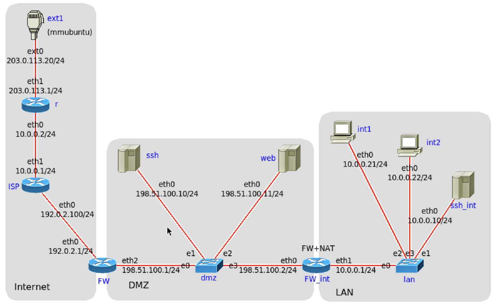

# 3. laboratorijska vježba
# Sigurnost mrežnih protokola i vatrozid

Dohvatite i instalirajte najnoviju verziju programa IMUNES:

```
$ sudo su
# cd /root/imunes
# git pull
# make install
# exit
```

Dohvatite najnoviju verziju zadatka:

```
$ cd ~/sigkom-lab/zadatak3
$ git pull
```

Ako se ispiše poruka:

```
fatal: detected dubious ownership in repository at '/home/student/sigkom-lab'
```
popravite vlasnika i ponovite naredbu `git pull`
```
$ sudo chown -R student:student ~student
$ git pull
```

## 1) Konfiguracija vatrozida 

U datoteci NETWORK.imn se nalazi primjer mreže s demilitariziranom zonom.

Pokrenite IMUNES eksperiment:
```
$ sudo imunes NETWORK.imn
```
Pokretanjem eksperimenta, na čvorovima `FW`, `FW_int`, `ssh`, `web` i `ssh_int` će se automatski pokrenuti mrežne usluge: Telnet, FTP i SSH.
Pozivanjem skripte `start_http.sh` dodatno će se još pokrenuti i Web poslužitelj na čvoru `web` i postaviti rute za dostup do mreža 192.0.2.0/24 i 198.51.100.0/24:
```
$ sudo ./start_http.sh
```

 

Vaš je zadatak konfigurirati vanjski i unutarnji vatrozid (`FW` i `FW_int`) te provjeriti dostupnost usluga iz vanjske mreže (Interneta) i iz lokalne mreže.

U DMZ se nalaze: web poslužitelj (`web`) i ssh poslužitelj (`ssh`), a u unutarnjoj mreži (LAN) se nalaze ssh poslužitelj (`ssh_int`) i dva korisnička računala, `int1` i `int2`.

Unutarnja mreža LAN koristi privatne adrese te je na vatrozidu `FW_int` konfiguriran NAT:
- sve konekcije iz lokalne mreže (LAN) prema Internetu odlaze s IP adresom sučelja eth0 vatrozida `FW_int`, 198.51.100.2,
- IP adresa se ne mijenja za konekcije prema računalima u DMZ.
 
Pravila za translaciju adresa na vatrozidu `FW_int` su već upisana u datoteku `FW_int.sh` i nije ih potrebno mijenjati.

Definirajte `nftables` pravila na `FW` i `FW_int` u skladu sa sljedećim zahtjevima:

- računala iz lokalne mreže (LAN) imaju neograničeni pristup poslužiteljima u DMZ i Internetu,
- pristup iz vanjske mreže u lokalnu LAN mrežu je zabranjen,
- iz vanjske mreže (Interneta) dozvoljen je pristup web poslužitelju `web` korištenjem protokola HTTP i HTTPS (portovi 80 i 443),
- iz vanjske mreže (Interneta) dozvoljen je pristup ssh poslužitelju `ssh` korištenjem protokola SSH (port 22),
- s poslužitelja `web` je dozvoljen pristup DNS poslužiteljima u Internetu (UDP i TCP port 53),
- SSH pristup vatrozidima `FW` i `FW_int` je dozvoljen samo s računala `int1` (LAN),
- dodajte "anti-spoofing" pravila.

### Skripte za konfiguriranje vatrozida

U direktoriju se nalaze dvije shell skripte za konfiguriranje vatrozida: `FW.sh` i `FW_int.sh`.

Modificirajte postojeća pravila i dodajte nova pravila u skladu sa zahtjevima.
Pomoćna skripta `start_fw` kopirat će vaše konfiguracijske skripte (FW.sh i FW_int.sh) na odgovarajuće čvorove i tamo će ih pokrenuti:
```
sudo ./start_fw
```

## 2) Testiranje vatrozida

Kao što se vidi na slici, iz Ubuntu možete pristupati čvorovima u mreži (koristi se "External connection", ext1).

### Testiranje postavljenih pravila vatrozida spajanjem na poslužitelje

Provjerite dostupnost usluga spajanjem izvana (iz Ubuntu) i spajanjem s virtualnih čvorova:

- otvorite terminal na Ubuntu i pokušajte se spojiti naredbom ssh na `ssh`, `web`, `FW` i `FW_int`:
```
$ ssh 198.51.100.10
$ ssh 198.51.100.11
$ ssh 192.0.2.1
$ ssh 198.51.100.2
```
- s čvorova `int1` i `int2` se pokušajte spojiti na ssh port na čvorovima `ssh_int`, `ssh`, `web`, `FW` i `FW_int`:
```
$ sudo himage int1 ssh 10.0.0.10
$ sudo himage int1 ssh 198.51.100.10
$ sudo himage int1 ssh 198.51.100.11
$ sudo himage int1 ssh 192.0.2.1
$ sudo himage int1 ssh 198.51.100.2
```
- na Ubuntu pokrenite Firefox i spojite se na stranicu http://198.51.100.11

### Skeniranje alatom nmap

Skeniranje dostupnih servisa može se provesti i alatom `nmap`. Prije pokretanja naredbe `nmap`, na skeniranom čvoru pokrenite naredbu koja će vam omogućiti praćenje dolaznih veza:
```
$ sudo himage _skenirani_čvor_ watch -n 0.5 netstat -ant
```
Korištenjem alata Wireshark možete vidjeti promet koji alat `nmap` generira.

Primjer, provjera dostupnosti usluga u demilitariziranoj zoni računalima iz Interneta (direktno iz Ubuntu):
```
$ nmap -n -Pn "-p20-25,53,80,443" 198.51.100.10
$ nmap -n -Pn "-p20-25,53,80,443" 198.51.100.11
```
Provjera dostupnosti usluga u demilitariziranoj zoni računalima iz privatne mreže (čvor `int1`):
```
$ sudo himage int1 nmap -n -Pn "-p20-25,53,80,443" 198.51.100.10
$ sudo himage int1 nmap -n -Pn "-p20-25,53,80,443" 198.51.100.11
```
Isprobajte sljedeće opcije u alatu `nmap`:
 - skeniranje TCP i UDP portova
 - TCP syn scan
 - detekcija operacijskog sustava (-O)
 - detekcija verzija servisa (-sV)
 - općeniti scan (-A opcija)

Navedite koji je način skeniranja prouzročio promjenu ispisa naredbe `watch netstat`. Objasnite.

## 3) Konfiguracija ssh poslužitelja i "jump host" pristup
Konfigurirajte ssh poslužitelje na čvorovima `ssh` (u DMZ-u) i `ssh_int` (u
LAN-u) tako da se korisnik **root** uz pomoć svog para privatnog i javnog
ključa može spojiti na čvor `ssh_int` iz "Interneta" (Ubuntu) ali samo preko
čvora `ssh`. To je moguće napraviti koristeći tehniku "jump host":
```
$ ssh -J user1@IP1:port1 user2@IP2:port2 ... user_end@IP_end -p port_end
```
u kojoj se ssh veza prosljeđuje na konačno odredište kroz jedan ili više
posredničkih poslužitelja.

Čvor `ssh` potrebno je konfigurirati tako da sluša na vratima 22, a čvor
`ssh_int` na vratima 2222. Konfiguracije su tekstualne datoteke `/etc/ssh/sshd_config`
u pojedinim čvorovima. Tu datoteku moguće je uređivati na samom IMUNES čvoru s
uređivačem teksta iz konzole (nano, vi...) ili preuzeti sa čvora, promijeniti
je lokalno u bilo kojem uređivaču teksta, te vratiti natrag u čvor naredbama
(npr. za čvor `ssh_int`):
```
# hcp ssh_int:/etc/ssh/sshd_config sshd_config_mail
# ... # uredi datoteku
# hcp sshd_config_mail ssh_int:/etc/ssh/sshd_config
```
Nakon svake promjene konfiguracije, ponovno pokrenite ssh poslužitelj na čvoru
naredbom (npr. za čvor `ssh_int`):
```
# himage ssh_int service ssh restart
```
Potrebno je omogućiti spajanje na čvor `ssh_int` iz "Interneta" (Ubuntu) naredbom:
```
# ssh -J root@198.51.100.10 root@10.0.0.10 -p 2222)
```
NAPOMENA: Ukoliko je to potrebno, na svakom čvoru možete postaviti lozinku
korisnika root naredbom `passwd`.

Nadopunite datoteke `FW.sh` i `FW_init.sh` pravilima potrebnim za ovaj zadatak.

Opišite što ste sve morali konfigurirati na poslužiteljima. Navedite 3 opcije
u konfiguracijskoj datoteci koje biste uključili/isključili kako bi ssh 
poslužitelji bili bolje zaštićeni. Objasnite.

## Alati korisni za izradu ove vježbe:

- `ping` - provjera mrežne povezivosti.
- `nmap` - skeniranje računala i servisa.
- `netstat` - pregled mrežnih servisa koji su trenutno pokrenuti na računalu.
- `service` - pokretanje i zaustavljanje servisa na operacijskom sustavu Linux.
- `nft` - konfiguracija vatrozida na operacijskom sustavu Linux.
- `wireshark` - analiza mrežnog prometa.
